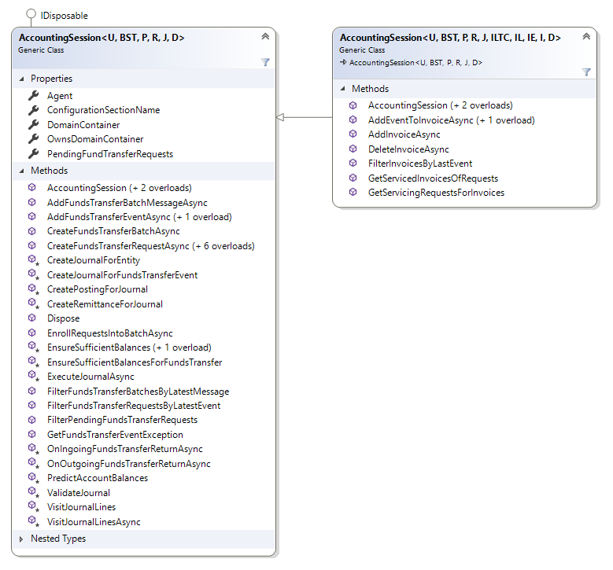

# Grammophone.Domos.Accounting
This .NET Framework library provides a base for accounting for the Domos integrated session system.

## Overview

Typically it is used under [Grammophone.Domos.Logic](https://github.com/grammophone/Grammophone.Domos.Logic) but it is
defined as a separate library to ease focus, separation of concerns and unit testing of accounting operations in a Domos
entity space.

It provides `AccountingSession` class as an abstract base to derive from in order to enrich it with the methods running your application. The class `AccountingSession` is provided with two generic variants.
The first, `AccountingSession<U, BST, P, R, J, D>` understands the minimum required entities of Domos accounting domain,
where `BST` is the base type for the state transitions of any stateful objects in the domain, `P` is the type
of accounting postings in the domain, `R` is the type of remittances in the domain, `J` is the type of accounting journals in the domain and `D` is the type of the domain container. If the optional invoice entities are used in the Domos domain,
derive from the more specific `AccountingSession<U, BST, P, R, J, ILTC, IL, IE, I, D>`, where `I` is the type of invoices, `IL` is the type of invoice lines and `ILTC` is the type of tax components in a invoice line.

## Creating an `AccountingSession`
In order to construct an `AccountingSession` derivative, a confuguration section name must be provided
where dependencies are defined in Unity syntax, 
an acting user must be specified and optionally a domain container must be supplied,
otherwise the domain container will be resolved from the configuration section.
The acting user can be either passed directly or a lambda expression defining her can be given.

The dependencies defined in the configuration section are available through the `Settings` property.

When used by a [Grammophone.Domos.Logic](https://github.com/grammophone/Grammophone.Domos.Logic) manager,
an `AccountingSession` can share the same configuration section with the logic layer, so things like
domain container resolution and others don't need to be specified twice.

## Dependencies

This library expects your solution referencing the following libraries being in sibling directories:
* [Grammophone.DataAccess](https://github.com/grammophone/Grammophone.DataAccess)
* [Grammophone.Domos.DataAccess](https://github.com/grammophone/Grammophone.Domos.DataAccess)
* [Grammophone.Caching](https://github.com/grammophone/Grammophone.Caching)
* [Grammophone.Setup](https://github.com/grammophone/Grammophone.Setup)
* [Grammophone.Serialization](https://github.com/grammophone/Grammophone.Serialization)
* [Grammophone.Domos.Domain](https://github.com/grammophone/Grammophone.Domos.Domain)
